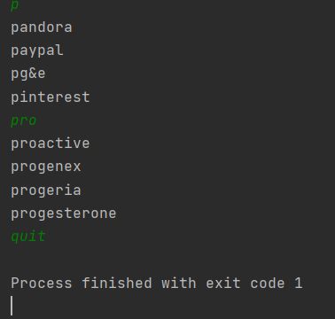

# AutoComplete

A user types a letter(s), this program is used to display,
a suggestion of 4 words, from a given keywords list,
starting with this(these) letter(s) sought.

The displayed words must be ordered in alphabetical order.

## Getting Started

### Prerequisities

**Tools:**

* [IntelliJ IDEA](https://www.jetbrains.com/idea/download/#section=windows)

**Installing:**
&nbsp;
* [JDK](https://www.oracle.com/java/technologies/javase-downloads.html) 8
* [SBT](https://www.scala-sbt.org/download.html) 1.4.6
* [Scala](https://www.scala-lang.org/download/) 2.13.0

**Dependencies:**

&nbsp;
will be added to the build.sbt file
1. [typesafe](https://mvnrepository.com/artifact/com.typesafe/config/1.3.3) :`libraryDependencies += "com.typesafe" % "config" % "1.3.3"`
2. [scalatest](https://mvnrepository.com/artifact/org.scalatest/scalatest_2.11/3.1.1) :`libraryDependencies += "org.scalatest" %% "scalatest" % "3.1.1" % Test`
3. [slf4j](https://mvnrepository.com/artifact/org.slf4j/slf4j-log4j12/1.2)
## Running the tests
This command will build and run the regular tests:

`sbt test`

For Unit tests, `Flatspec` style is used.
&nbsp;

example: testing autocomplete method :

`val nonEmptyList: List[String] = KeyWordsReader.loadFiles("/keywords.csv")`&nbsp;

nonEmptyList = List ("project", "river", "kayak", "proactive")

`"autoComplete method" should "return 'kayak' when looking for words starting with 'k'" in {
processor.autoComplete(nonEmptyList, "k") shouldBe List("kayak")
}`

## Usage
**Autocomplete** can be run through the terminal by typing this command.
&nbsp;

`sbt run`

You can also run it as an App from the **AutoCompleteApp.scala** script
or with keyboard shortcut `Ctrl`+`Maj`+`F10`.
&nbsp;

Then it will prompt you to write your inputs. With your keyboard,
you can type the first letter(s) of the word you'd like to look
for in the given keywords list.
&nbsp;

If your typed letter(s) does not match with any of the keyword list,
no suggestion will appear

You have as many tries as you wants...
Until you decide to type `quit` to exist the program

## Versioning

V1.0.0

## Additional Questions
1. This program is designed to support big files and prevent stack overflow error,
   if the keyword file grows.
   But for more optimization once we are talking about hundreds of Gb, we

2. This program is written with different methods to be the most scalable, in order to
   facilitate any change in the future.

   If the requirements were to match any portion of the keywords, I would change
   the AutoComplete method in the class AutoCompleteProcessor, and instead of comparing
   the typed value with the first slice (same length) in the words referential,
   we should consider them as list of character and compare character by character. Example:

   looking for 'pro' in 'reprobe':

   step 1: get the number of character we will look for => 3

   step 2: comparison =>

   p != r and length != 3 => to the next character

   p != e and length != 3 => to the next character

   p = p and length != 3 => partially ok, check the second character

   pr = pr and length != 3 => partially ok, check the third character

   pro = pro => ok

   step 3: keep this word and pass to the next
   
   